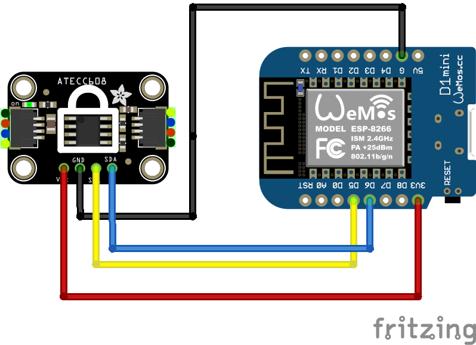
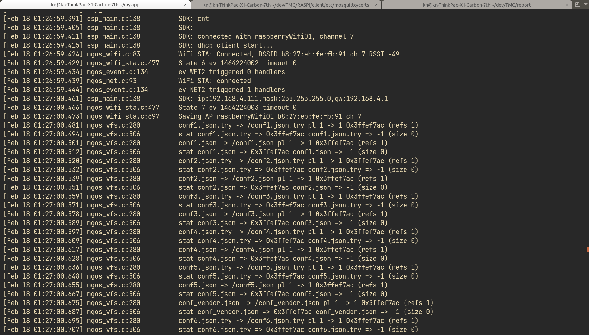
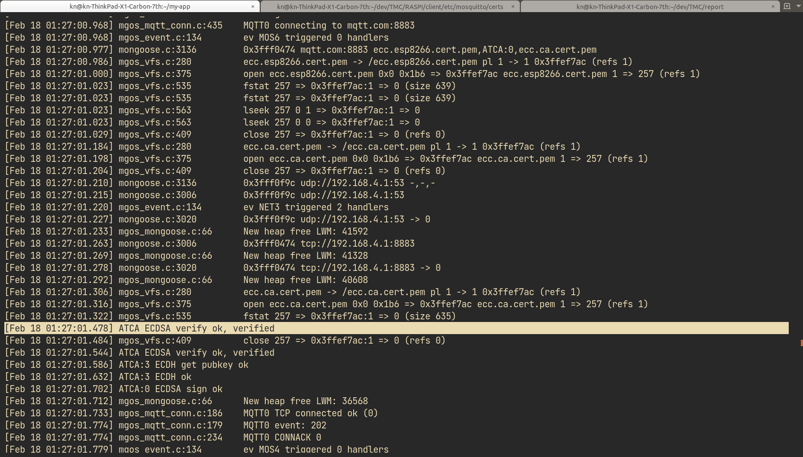
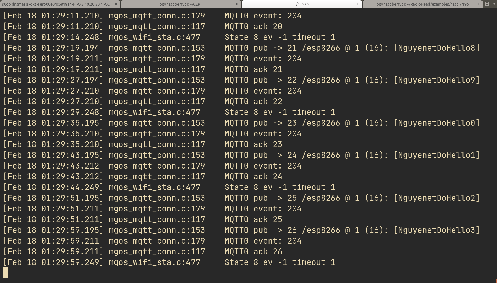
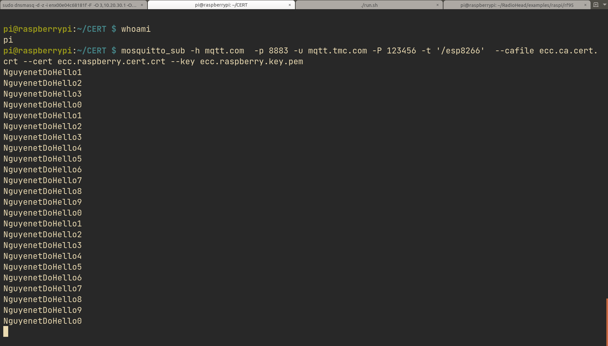
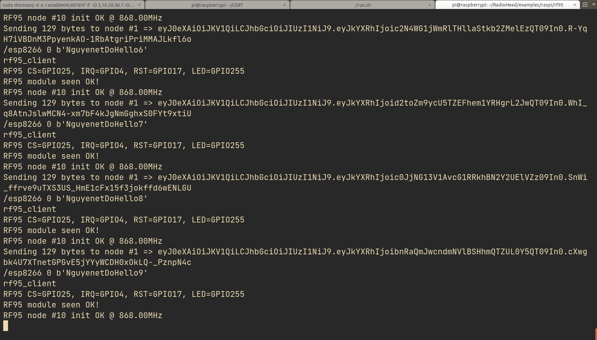

---
title: "TMC Project"
author: \textbf{DO Duy Huy Hoang} \newline
        \newline
        \textit{University of Limoges} \newline 
date: \today
titlepage: false
header-includes: |
    \usepackage{multicol}
    \usepackage{graphicx}
footer-left: DO Duy Huy Hoang - NGUYEN Van Lam
mainfont: "NewComputerModern"
sansfont: "NewComputerModern"
monofont: "JetBrains Mono"
caption-justification: centering
#pandoc openstack.md -o openstack.pdf --from markdown --template eisvogel --listings -V fontsize=13pt --pdf-engine=xelatex
...
\pagenumbering{Roman} 

\newpage{}
\listoftables
\newpage{}
\listoffigures
\newpage{}
\tableofcontents
\newpage{}

\pagenumbering{arabic} 

\vspace{3cm}
\newpage{}

\pagenumbering{arabic} 


# Introduction

In this project, we have finished all the requirement tasks which is to  create a network of sensors
(ESP8266) connected by WiFi to a concentrator (Raspberry Pi), where each sensor will use a circuit dedicated to cryptography on an elliptical curve (ATECC608) connected to the ESP8266 by the I2C bus. They use the MQTT protocol to send measurements back to the concentrator through a WIFI connection. Each sensor corresponds to an ESP8266 integrated into the "Wemos" development board.A Raspberry Pi acts as the hub that runs an MQTT “broker” with mosquitto software and also serves as a WiFi access point by using hostapd software. By using Mongoose OS, we successfully achieved the goal to program ESP8266 embedded system, implemented TLS and use the ATECC608 component to perform encryption/signature/verification operations. And for the Raspberry Pi with the LoRa hat, we created an LoRa client server system, a client will subcribe to the topic and listen for the message from ESP8266 and this data will then be encrypted and transmitted between two concentrators through the LoRa protocol. (the Raspberry Pi with LoRa Server). 

For demo video: [**here**](https://youtu.be/ySEE6XHZRPk) \
It's available with caption.

# System Setup

For this system, we use two Raspberry Pi with LoRa hat, an ESP8266 connecting to ATECC608 chip and connected to laptop for flashing firmware and power up. The whole system is setup as the figure bellow.


The ATECC608 chip connects to the ESP8266 as the bellow circuit



# Implementation

This report contains the results, important note while working on this project and the reason why we implemented these source code and instructions and also the instructions and source code in Appendix section

## Raspberry Pi & WiFi

The Raspberry Pi is connected to our laptop for TFTP/BOOTP/PXE protocol. We use the raspbian lite image and setup like in the TP class, more details is in our appendix.

For the Wifi part which is to allow the ESP82266 reachs the concentrator. We created a Wifi access point on the Raspberry Pi with `hostapd` and `dnsmasq` package. Also note that we need to configure dnsmasq to allow the dns to resolve a domain in mqtt.com


## Create ECC key and Certificate

We generated ECC Key and Certificate as in the appendix.

- CA key and certificate:
    - ecc.ca.key.pem
    - ecc.ca.cert.crt
- ESP8266 client key and certificate:
    - ecc.esp8266.key.pem
    - ecc.esp8266.cert.crt
- Raspberry Pi server key and certificate:
    - ecc.raspberry.key.pem
    - ecc.raspberry.cert.crt

A Small note for this part is to use `.crt` file extension but for the the ESP8266 with mongoose OS and mqttq libs, they require `.pem` instead. So we generate Certificate with `.crt` file extension and later on, we will convert it with OpenSSL for ESP8266 cert and CA Cert.

## MQTT Server for Raspberry Pi

In this part, we use Mosquitto for MQTT and also since the version 2.0.0 we need to put SSL/TLS server keys and certificates in the directory `/etc/mosquitto/certs` and SSL/TLS Certificate Authority certificates in `/etc/mosquitto/ca_certificates`. And then we specify these path in `mosquitto.conf` file. But we was introduced a new problem (after restart moquitto server and check the log with `/var/log/moquitto/mosquitto.log`), I need the permission to read keys file. So I give these key file the read access permission for GROUP. We also need to specify the port 8883 which is use for TLS, and ctivate the protection of access to the server by a user and password.

Now we should be able to test mqtt server with our computer by using:

```bash
To publish a topic using the username *mqtt.tcm.com* and pass *123456* and a client certificate (cert for esp8266)

kn@x1c7$: mosquitto_pub -h mqtt.com -p 8883 -u mqtt.tmc.com -P 123456 -t '/esp8266' --cafile ecc.ca.cert.pem --cert ecc.esp8266.cert.pem --key ecc.es8266.key.pem -m 'TMC'

To subcribe a topic using the username *mqtt.tcm.com* and pass *123456789* and a server certificate (cert for raspberry)

pi@raspi$: mosquitto_sub -h mqtt.com -p 8883 -u mqtt.tmc.com -P 123456 -t '/esp8266' --cafile ecc.ca.cert.crt --cert ecc.raspberry.cert.crt --key ecc.raspberry.key.pem
```

## ESP8266: Mongoose OS 

For flashing firmware, we connect ESP8266 to PC using USB cable.
In this part, we need to modify the `mos.yml`. To complete this project, we need to change alot of things comparing to the example file provided in this project. First of all in the newer version of `mqtt` lib, the config schema `mqtt.pub` and `mqtt.sub` is deprecated and we do not need to specify it here. lso we need to enable `MG_ENABLE_SSL: 1` in build variables. Also there is additional libraries required as in the appendix which is `mebedtls` and `rpc-service-i2c`. 
We also need to put CA cert and ESP8266 cert that we generated before, but it is important to convert these to `.pem` file for using it with mongoose os.

The ESP8266 will behave like an MQTT client which performs a publish on the `/esp8266` topic by connecting to the MQTT server of the Raspberry Pi playing the role
of hub and which makes it subscribe on the same topic to receive the data. To communicate, the concentrator and the client use the WiFi access point already created, to which the client will connect. The key is verified by ATCA service using ATECC608 chip.



Authentication of the ESP8266 client with the MQTT server:




## ESP8266 Publish topic




## Raspberry Pi Subcribe topic



## AES




# Conclusion and Future Work

In this project, we successfully implemented and achieved all the project requirement and also learn how to setup LoRa, MQTT server and how to use IoT with mongoose, ESP8266 and ATECC608 crypto chip. For the future work, we will optimize the code and improve the AES and JWT.

# Appendix

## Raspberry Pi & WiFi

```bash
kn@x1c7$ mkdir RASPI
kn@x1c7$ cd RASPI
kn@x1c7$ wget https://downloads.raspberrypi.org/raspbian_lite_latest
kn@x1c7$ unzip raspbian_lite_latest
```

First we need to check available loop device with `losetup`, in my computer it is loop25.

```bash
kn@x1c7$ sudo losetup -P /dev/loop25 2019-09-26-raspbian-buster-lite.img
kn@x1c7$ sudo mount /dev/loop25p2 /mnt
kn@x1c7$ mkdir client
kn@x1c7$ sudo rsync -xa --progress /mnt/ client/
kn@x1c7$ sudo umount /mnt
```

Read boot partition from image

```bash
kn@x1c7$ mkdir boot
kn@x1c7$ sudo mount /dev/loop25p1 /mnt
kn@x1c7$ cp -r /mnt/* boot/
kn@x1c7$ sudo umount /mnt
```

Install `nfs-kernel-server` and `rpcbind`

```bash
kn@x1c7$ sudo apt update
kn@x1c7$ sudo apt install nfs-kernel-server rpcbind
```

Configuring the NFS share in the `/etc/exports` file:

```bash
kn@x1c7$ cat /etc/exports
# /etc/exports: the access control list for filesystems which may be exported
# to NFS clients. See exports(5).
#
# Example for NFSv2 and NFSv3:
# /srv/homes hostname1(rw,sync,no_subtree_check)
#hostname2(ro,sync,no_subtree_check) # might cause nfs to fail to start
#
# Example for NFSv4:
# /srv/nfs4 gss/krb5i(rw,sync,fsid=0,crossmnt,no_subtree_check)
# /srv/nfs4/homes gss/krb5i(rw,sync,no_subtree_check)

/home/kn/RASPI/client *(rw,sync,no_subtree_check,no_root_squash)
/home/kn/RASPI/boot *(rw,sync,no_subtree_check,no_root_squash)
```

Enable the NFS and RPCBind service:

```bash
kn@x1c7$ sudo systemctl enable nfs-kernel-server
kn@x1c7$ sudo systemctl enable rpcbind
```
Start the services:

```bash
kn@x1c7$ sudo systemctl start nfs-kernel-server
kn@x1c7$ sudo systemctl start rpcbind
```
If you modify the configuration of an export, you must restart the NFS service:

To see the mount points offered by an NFS server:

```bash
kn@x1c7$ showmount -e 127.0.0.1
Export list for 127.0.0.1:
/home/kn/RASPI/boot *
/home/kn/RASPI/client *
```

**Edit mount point**

Edit mount point for filesystem Raspberry Pi in `RASPI/boot/cmdline.txt`

```bash
kn@x1c7$ cat RASPI/boot/cmdline.txt
dwc_otg.lpm_enable=0 console=serial0,115200 console=tty1 root=/dev/nfs nfsroot=10.20.30.1:/home/kn/RASPI/client,vers=3 rw ip=dhcp rootwait elevator=deadline
```

Edit mount point for boot in `RASPI/client/etc/fstab`

```bash
kn@x1c7$ cat RASPI/client/etc/fstab 
proc            /proc          proc        defaults          0         0
10.20.30.1:/home/kn/RASPI/boot /boot nfs rsize=8192,wsize=8192,timeo=14,intr,noauto,x-systemd.automount 0 0
```

**Enable SSH for Raspberry Pi**

```bash
kn@x1c7$ cat RASPI/client/lib/systemd/system/sshswitch.service 
[Unit]
Description=Turn on SSH if /boot/ssh is present
#ConditionPathExistsGlob=/boot/ssh{,.txt}
After=regenerate_ssh_host_keys.service
[Service]
Type=oneshot
ExecStart=/bin/sh -c "update-rc.d ssh enable && invoke-rc.d ssh start && rm -f /boot/ssh; rm -f /boot/ssh.txt"
[Install]
WantedBy=multi-user.target
```

### Setup Dnsmasq, DHCP using PC Ethernet connection:
kn@x1c7:$ IF=enx00e04c68181f
kn@x1c7:$ PREFIX=10.20.30

```bash
kn@x1c7:$ sudo sysctl -w net.ipv4.ip_forward=1
kn@x1c7:$ sudo ip link set dev $IF down
kn@x1c7:$ sudo ip link set dev $IF address aa:aa:aa:aa:aa:aa
kn@x1c7:$ sudo ip link set dev $IF up
kn@x1c7:$ sudo ip address add dev $IF $PREFIX.1/24
kn@x1c7:$ sudo iptables -t nat -A POSTROUTING -s $PREFIX.0/24 -j MASQUERADE
```

In case IP address does not hold and keep changing. Configure static IP in file: `/etc/network/ interfaces`

```bash
kn@x1c7$ cat /etc/network/interfaces
...
# interfaces(5) file used by ifup(8) and ifdown(8)
auto lo
iface lo inet loopback

auto enx00e04c68181f
iface enx00e04c68181f inet static
        address 10.20.30.1
        netmask 255.255.255.0
        dns-nameservers 8.8.8.8
        dns-nameservers 8.8.4.4 
```

and config nameserver in `/etc/resolv.conf` for dnsmasq to use.

```bash
kn@x1c7$ cat /etc/resolv.conf
...
# See man:systemd-resolved.service(8) for details about the supported modes of
# operation for /etc/resolv.conf.

#options edns0
nameserver 127.0.0.53
```

Start Dnsmasq:

```bash
kn@x1c7$ 
sudo dnsmasq -d -z -i enx00e04c68181f -F 10.20.30.100,10.20.30.150,255.255.255.0,12h -O 3,10.20.30.1 -O 6,8.8.8.8,8.8.4.4 --pxe-service=0,"Raspberry Pi Boot" --enable-tftp --tftp-root=/home/kn/RASPI/boot
```

Connect Rapsberry Pi to PC, and wait for DHCP handshake from dnsmasq:
``` 
kn@x1c7$
...
dnsmasq-dhcp: DHCPDISCOVER(enx00e04c68181f) b8:27:eb:73:ff:53 
dnsmasq-dhcp: DHCPOFFER(enx00e04c68181f) 10.20.30.129 b8:27:eb:73:ff:53 
dnsmasq-tftp: file /home/kn/RASPI/boot/bootsig.bin not found
dnsmasq-tftp: sent /home/kn/RASPI/boot/bootcode.bin to 10.20.30.129
dnsmasq-dhcp: DHCPDISCOVER(enx00e04c68181f) b8:27:eb:73:ff:53 
dnsmasq-dhcp: DHCPOFFER(enx00e04c68181f) 10.20.30.129 b8:27:eb:73:ff:53 
dnsmasq-tftp: file /home/kn/RASPI/boot/2073ff53/start.elf not found
dnsmasq-tftp: file /home/kn/RASPI/boot/autoboot.txt not found
dnsmasq-tftp: sent /home/kn/RASPI/boot/config.txt to 10.20.30.129
dnsmasq-tftp: file /home/kn/RASPI/boot/recovery.elf not found
dnsmasq-tftp: sent /home/kn/RASPI/boot/start.elf to 10.20.30.129
dnsmasq-tftp: sent /home/kn/RASPI/boot/fixup.dat to 10.20.30.129
dnsmasq-tftp: file /home/kn/RASPI/boot/recovery.elf not found
dnsmasq-tftp: sent /home/kn/RASPI/boot/config.txt to 10.20.30.129
dnsmasq-tftp: file /home/kn/RASPI/boot/dt-blob.bin not found
dnsmasq-tftp: file /home/kn/RASPI/boot/recovery.elf not found
dnsmasq-tftp: sent /home/kn/RASPI/boot/config.txt to 10.20.30.129
dnsmasq-tftp: file /home/kn/RASPI/boot/bootcfg.txt not found
dnsmasq-tftp: sent /home/kn/RASPI/boot/bcm2710-rpi-3-b.dtb to 10.20.30.129
dnsmasq-tftp: sent /home/kn/RASPI/boot/config.txt to 10.20.30.129
dnsmasq-tftp: sent /home/kn/RASPI/boot/cmdline.txt to 10.20.30.129
dnsmasq-tftp: file /home/kn/RASPI/boot/recovery8.img not found
dnsmasq-tftp: file /home/kn/RASPI/boot/recovery8-32.img not found
dnsmasq-tftp: file /home/kn/RASPI/boot/recovery7.img not found
dnsmasq-tftp: file /home/kn/RASPI/boot/recovery.img not found
dnsmasq-tftp: file /home/kn/RASPI/boot/kernel8-32.img not found
dnsmasq-tftp: error 0 Early terminate received from 10.20.30.129
dnsmasq-tftp: failed sending /home/kn/RASPI/boot/kernel8.img to 10.20.30.129
dnsmasq-tftp: file /home/kn/RASPI/boot/armstub8-32.bin not found
dnsmasq-tftp: error 0 Early terminate received from 10.20.30.129
dnsmasq-tftp: failed sending /home/kn/RASPI/boot/kernel7.img to 10.20.30.129
dnsmasq-tftp: sent /home/kn/RASPI/boot/kernel7.img to 10.20.30.129
dnsmasq-dhcp: DHCPDISCOVER(enx00e04c68181f) b8:27:eb:73:ff:53 
dnsmasq-dhcp: DHCPOFFER(enx00e04c68181f) 10.20.30.129 b8:27:eb:73:ff:53 
dnsmasq-dhcp: DHCPREQUEST(enx00e04c68181f) 10.20.30.129 b8:27:eb:73:ff:53 
dnsmasq-dhcp: DHCPACK(enx00e04c68181f) 10.20.30.129 b8:27:eb:73:ff:53 

```

### Wifi AP

```
kn@x1c7$ ssh pi@10.20.30.129
```
Run `raspi-config` and config the wifi country to avoid rfkill block wifi.

```bash
pi@raspberrypi:~ $ sudo rfkill unblock all
```

Install dnsmasq and hostapd for wifi hotspot in RaspPi
```
pi@raspberrypi$ sudo apt update
pi@raspberrypi$ sudo apt-get install hostapd dnsmasq
```

Config Dnsmasq`/etc/dnsmasq.conf`
```
sudo mv /etc/dnsmasq.conf /etc/dnsmasq.conf.bak
sudo vim /etc/dnsmasq.conf                           

interface=wlan0        
dhcp-range=192.168.4.100,192.168.4.120,255.255.255.0,12h
domain=wlan
address=/mqtt.com/192.168.4.1        
```

Config hostapd `/etc/hostapd/hostapd.conf` for Wifi AP

```bash
pi@raspberrypiberrypi:~ $ cat /etc/hostapd/hostapd.conf 
country_code=FR
interface=wlan0
ssid=raspberryWifi01
hw_mode=g
channel=7
wmm_enabled=0
macaddr_acl=0
auth_algs=1
ignore_broadcast_ssid=0
wpa=2
wpa_passphrase=raspberry01
wpa_key_mgmt=WPA-PSK
wpa_pairwise=TKIP
rsn_pairwise=CCMP
```

Config ipv4 forwarding

```bash
$ sudo vim /etc/sysctl.conf

net.ipv4.ip_forward=1     #uncomment this line
```

### Static and manual config

Add nameserver in resolvconf.conf for dnsmasq

```bash
pi@raspberrypiberrypi:~ $ cat /etc/resolvconf.conf 
# Configuration for resolvconf(8)
# See resolvconf.conf(5) for details

resolv_conf=/etc/resolv.conf
# If you run a local name server, you should uncomment the below line and
# configure your subscribers configuration files below.
name_servers=127.0.0.56

# Mirror the Debian package defaults for the below resolvers
# so that resolvconf integrates seemlessly.
dnsmasq_resolv=/var/run/dnsmasq/resolv.conf
pdnsd_conf=/etc/pdnsd.conf
unbound_conf=/var/cache/unbound/resolvconf_resolvers.conf
```
Set Static IP and allow-hotplug for wlan0 to UP.

```bash
pi@raspberrypiberrypi:~ $ cat /etc/network/interfaces
# interfaces(5) file used by ifup(8) and ifdown(8)

# Please note that this file is written to be used with dhcpcd
# For static IP, consult /etc/dhcpcd.conf and 'man dhcpcd.conf'

# Include files from /etc/network/interfaces.d:
source-directory /etc/network/interfaces.d

allow-hotplug wlan0
iface wlan0 inet static
	address 192.168.4.1
	netmask 255.255.255.0
	gateway 192.168.4.1
```

Enable hostapd

```bash
pi@raspberrypi$ sudo systemctl unmask hostapd
pi@raspberrypi$ sudo systemctl enable hostapd
pi@raspberrypi$ sudo systemctl start hostapd
pi@raspberrypi$ sudo systemctl enable dnsmasq
```

### ECC encryption: keys and certificates

Generation of private keys for the CA, the server and the client.
    
```bash
openssl ecparam -out ecc.ca.key.pem -name prime256v1 -genkey 
openssl ecparam -out ecc.raspberry.key.pem -name prime256v1 -genkey 
openssl ecparam -out ecc.esp8266.key.pem -name prime256v1 -genkey
```
Generation self-signed certificate of the CA which will be used to sign those of the server and client

```bash
openssl req -config <(printf "[req]\ndistinguished_name=dn\n[dn]\n[ext]\nbasicConstraints=CA:TRUE") -new -nodes -subj "/C=FR/L=Limoges/O=TMC/OU=IOT/CN=ACTMC" -x509 -extensions ext -sha256 -key ecc.ca.key.pem -text -out ecc.ca.cert.crt

```

Generation and signing of the certificate for the server (Raspberry Pi)

```bash
openssl req -config <(printf "[req]\ndistinguished_name=dn\n[dn]\n[ext]\nbasicConstraints=CA:FALSE") -new -subj "/C=FR/L=Limoges/O=TMC/OU=IOT/CN=mqtt.com" -reqexts ext -sha256 -key ecc.raspberry.key.pem -text -out ecc.raspberry.csr.pem

openssl x509 -req -days 3650 -CA ecc.ca.cert.pem -CAkey ecc.ca.key.pem -CAcreateserial -extfile <(printf   "basicConstraints=critical,CA:FALSE") -in ecc.raspberry.csr.pem -text -out ecc.raspberry.cert.crt -addtrust clientAuth
```
Generating and signing the certificate for the client - ESP8266

```
openssl req -config <(printf "[req]\ndistinguished_name=dn\n[dn]\n[ext]\nbasicConstraints=CA:FALSE") -new -subj   "/C=FR/L=Limoges/O=TMC/OU=IOT/CN=esp8266" -reqexts ext -sha256 -key ecc.esp8266.key.pem -text -out ecc.esp8266.csr.pem

openssl x509 -req -days 3650 -CA ecc.ca.cert.pem -CAkey ecc.ca.key.pem -CAcreateserial -extfile <(printf   "basicConstraints=critical,CA:FALSE") -in ecc.esp8266.csr.pem -text -out ecc.esp8266.cert.crt -addtrust clientAuth
```

### MQTT Server

First to fix network:

```bash
sudo -s
echo "nameserver 8.8.8.8" >> /etc/resolv.conf
chmod 644 /etc/resolv.conf
exit
ping google.com
```

or check ip tables or ip route on the Raspberry Pi

Installation of the MQTT server packages

```bash
sudo apt-get install mosquitto 
sudo apt-get install mosquitto-clients
```

Activate the protection of access to the server by a password
To activate the protection of access to the MQTT server by password, we add in the file `/etc/mosquitto/mosquitto.conf`

```
allow_anonymous false
password_file /etc/mosquitto/mosquitto_passwd

listener 8883
cafile /etc/mosquitto/ca_certificates/ecc.ca.cert.crt
certfile /etc/mosquitto/certs/ecc.raspberry.cert.crt
keyfile /etc/mosquitto/certs/ecc.raspberry.key.pem
require_certificate true
```

**NOTE** for version >2.0, you need to put Pi cert to /etc/mosquitto/certs and also CA cert in /etc/mosquitto/ca_certificates

It will enable the user authentication by password and certificate for mosquitto.

Then we use `mosquitto_passwd` to generate the user `mqtt.tmc.com` in file `mosquitto_passwd`:

```bash
sudo mosquitto_passwd -c /etc/mosquitto/mosquitto_passwd mqtt.tmc.com    
```

Restart Mosquitto service

```bash
sudo systemctl restarts mosquitto
```

## ESP8266: Mongoose OS + ATECC608

```bash
kn@latop$
sudo add-apt-repository ppa:mongoose-os/mos
sudo apt-get update
sudo apt-get install mos
```

To generate a flash, install docker and set the execution right

```
kn@latop$
$ sudo apt install docker.io
$ sudo groupadd docker
$ sudo usermod -aG docker $USER
```

### MQTT client application

#### Convert Cert to use in Mongoose OS

```bash
openssl x509 -in ecc.esp8266.cert.crt -out ecc.esp8266.cert.pem -outform PEM
openssl x509 -in ecc.ca.cert.crt -out ecc.ca.cert.pem -outform PEM
```

Install new app and config file `mos.yml` like following:

```bash
kn@x1c7$
$ git clone https://github.com/mongoose-os-apps/empty my-app
$ cd my-app
$ cat mos.yml

author: mongoose-os
description: A Mongoose OS app skeleton
version: 2.19.1
libs_version: ${mos.version}
modules_version: ${mos.version}
mongoose_os_version: ${mos.version}
# Optional. List of tags for online search.
tags:
    - c
# List of files / directories with C sources. No slashes at the end of dir names.
sources:
    - src
# List of dirs. Files from these dirs will be copied to the device filesystem

config_schema:
  - ["debug.level", 3]
  - ["sys.atca.enable", "b", true, {title: "enable atca for ATEC608"}]
  - ["i2c.enable", "b", true, {title: "Enable I2C"}]
  - ["sys.atca.i2c_addr", "i", 0x60, {title: "I2C address of the chip"}]
  - ["wifi.ap.enable", "b", false, {title: "Enable"}]
  - ["wifi.sta.enable", "b", true, {title: "Connect to existing WiFi"}]
  - ["wifi.sta.ssid", "raspberryWifi01"]
  - ["wifi.sta.pass", "raspberry01"]
  - ["mqtt.enable", true]
  - ["mqtt.server", "mqtt.com:8883"]
  - ["mqtt.user", "mqtt.tmc.com"]
  - ["mqtt.pass", "123456"]
  - ["mqtt.ssl_ca_cert", "ecc.ca.cert.pem"]
  - ["mqtt.ssl_cert", "ecc.esp8266.cert.pem"]
  - ["mqtt.ssl_key", "ATCA:0"]

cdefs:
  MG_ENABLE_MQTT: 1
  # MG_ENABLE_SSL: 1

build_vars:
  # Override to 0 to disable ATECCx08 support.    
  # Set to 1 to enable ATECCx08 support.
  # MGOS_MBEDTLS_ENABLE_ATCA: 0
  MGOS_MBEDTLS_ENABLE_ATCA: 1


libs:
  - origin: https://github.com/mongoose-os-libs/ca-bundle
  - origin: https://github.com/mongoose-os-libs/boards
  - origin: https://github.com/mongoose-os-libs/rpc-service-config
  - origin: https://github.com/mongoose-os-libs/rpc-mqtt
  - origin: https://github.com/mongoose-os-libs/rpc-uart
  - origin: https://github.com/mongoose-os-libs/wifi
  - origin: https://github.com/mongoose-os-libs/rpc-service-i2c
  - origin: https://github.com/mongoose-os-libs/mbedtls
  - origin: https://github.com/mongoose-os-libs/atca
  - origin: https://github.com/mongoose-os-libs/rpc-service-fs
  - origin: https://github.com/mongoose-os-libs/rpc-service-atca
  
# Used by the mos tool to catch mos binaries incompatible with this file format
manifest_version: 2017-05-18
```

Client ESP8266 code

```bash
kn@x1c7:my-app/$
$ cd src
$ cat main.c
#include <stdio.h>
#include "mgos.h"
#include "mgos_mqtt.h"
int i = 0;
static void my_timer_cb(void *arg) {
  if (i == 26) i = 0;
  char message[] = {'N', 'g', 'u', 'y' , 'e' , 'n', 'e', 't', 'D', 'o', 'H', 'e', 'l', 'l', 'o', '0'+i};
  i++;
  mgos_mqtt_pub("/esp8266", message, 16, 1, 0);
  (void) arg;
}
enum mgos_app_init_result mgos_app_init(void) {
  mgos_set_timer(5000, MGOS_TIMER_REPEAT, my_timer_cb, NULL);
  return MGOS_APP_INIT_SUCCESS;
}

```
### Build and Flash firmware for ESP8266


```bash
kn@x1c7:my-app/$
mos build --local --arch esp8266  
mos flash
```

Install private key into ATECC608:

```bash
kn@x1c7:my-app/$
$ openssl rand -hex 32 > slot4.key
$ mos -X atca-set-key 4 slot4.key --dry-run=false

AECC508A rev 0x5000 S/N 0x012352aad1bbf378ee, config is locked, data is locked
Slot 4 is a non-ECC private key slot
SetKey successful.
```

Then add certificate key to ATECC608

```bash
kn@x1c7:my-app/$
$ mos -X atca-set-key 0 ecc.esp8266.key.pem --write-key=slot4.key --dry-run=false

Using port /dev/ttyUSB0
ATECC508A rev 0x5000 S/N 0x0123fb976eb9b4f3ee, config is locked, data is locked
Slot 0 is a ECC private key slot
Parsed EC PRIVATE KEY
Data zone is locked, will perform encrypted write using slot 4 using slot4.key
SetKey successful.
```

You can also install the certificate in the "filesystem" of the ESP8266 without recompilation:

```bash
mos put ecc.ca.cert.pem
mos put ecc.esp8266.cert.pem
```

Start `mos console` to see the LOG from esp8266

## AES

For the use of the GPIOs pins and the SPI bus you will need the bcm2835 library:

```bash
wget http://www.airspayce.com/mikem/bcm2835/bcm2835-1.71.tar.gz
tar zxvf bcm2835-1.71.tar.gz
cd bcm2835-1.71
./configure
make
sudo make check
sudo make install
```

For the use of LoRa, we will use the following library:

```bash
git clone https://github.com/hallard/RadioHead
```
and then we modify the two source files: "rf95_server.cpp" and "rf95_client.cpp", to
select the dragino as the project description.

For the LoRa Client Python script:

```python
#!/bin/python3
import paho.mqtt.client as mqtt
import os, ssl, json, binascii, base64, jwt, subprocess
from urllib.parse import urlparse
from Crypto import Random
from Crypto.Cipher import AES

cafile ="/home/pi/CERT/ecc.ca.cert.crt"
cert = "/home/pi/CERT/ecc.raspberry.cert.crt"
key = "/home/pi/CERT/ecc.raspberry.key.pem"

def encrypt(message, passphrase):
    aes = AES.new(passphrase, AES.MODE_CBC, '0123456789abcdef')
    return base64.b64encode(aes.encrypt(message))

def on_message(client, obj, msg):
    print(msg.topic + " " + str(msg.qos) + " " + str(msg.payload))
    data=encrypt(msg.payload,"VietNamVoDich123")
    command ="sudo ./rf95_client "+jwt.encode( {'data':data.decode('utf-8') }, "MQTT", algorithm='HS256')
    os.system("%s"%(command))

mqttc = mqtt.Client()

# Assign event callbacks
mqttc.on_message = on_message

url_str = os.environ.get('CLOUDMQTT_URL', 'mqtt://mqtt.com:8883//esp8266')
url = urlparse(url_str)
topic = url.path[1:] or '/esp8266'

# Connect
mqttc.username_pw_set("mqtt.tmc.com", "123456")
mqttc.tls_set(ca_certs=cafile, certfile=cert, keyfile=key, cert_reqs=ssl.CERT_REQUIRED, tls_version=ssl.PROTOCOL_TLS, ciphers=None)
mqttc.connect(url.hostname, url.port)

# Start subscribe, with QoS level 0
mqttc.subscribe(topic, 0)

rc = 0
while rc == 0:
    rc = mqttc.loop()
```

For the LoRa Server Python script:

```python
#!/bin/python3
import jwt, subprocess, sys, binascii,os, ssl, base64
from Crypto.Cipher import AES
data = sys.argv[1]
#print("Received encoded JWT: " +data)
encoded = ""
try:
        encoded = jwt.decode(data, "MQTT")
        print("AES encrypted data: " + encoded['data'])
except:
        print("Error decoding JWT")
        exit(1)
decryption_suite = AES.new('VietNamVoDich123', AES.MODE_CBC, '0123456789abcdef')
try:
        plain_text = decryption_suite.decrypt(base64.b64decode(encoded['data']))
        print("AES Decrypted data : " + plain_text.decode('utf-8'))
except:
        print("Error AES decryption")
        exit(1)
```

For the RF95 server:

```c++
// rf95_server.cpp
//
// Example program showing how to use RH_RF95 on Raspberry Pi
// Uses the bcm2835 library to access the GPIO pins to drive the RFM95 module
// Requires bcm2835 library to be already installed
// http://www.airspayce.com/mikem/bcm2835/
// Use the Makefile in this directory:
// cd example/raspi/rf95
// make
// sudo ./rf95_server
//
// Contributed by Charles-Henri Hallard based on sample RH_NRF24 by Mike Poublon

#include <bcm2835.h>
#include <stdio.h>
#include <signal.h>
#include <unistd.h>
#include <iostream>
#include <string>
#include <stdexcept>
#include <RH_RF69.h>
#include <RH_RF95.h>

// define hardware used change to fit your need
// Uncomment the board you have, if not listed 
// uncommment custom board and set wiring tin custom section

// LoRasPi board 
// see https://github.com/hallard/LoRasPI
//#define BOARD_LORASPI

// iC880A and LinkLab Lora Gateway Shield (if RF module plugged into)
// see https://github.com/ch2i/iC880A-Raspberry-PI
//#define BOARD_IC880A_PLATE

// Raspberri PI Lora Gateway for multiple modules 
// see https://github.com/hallard/RPI-Lora-Gateway
//#define BOARD_PI_LORA_GATEWAY

// Dragino Raspberry PI hat
// see https://github.com/dragino/Lora
#define BOARD_DRAGINO_PIHAT

// Now we include RasPi_Boards.h so this will expose defined 
// constants with CS/IRQ/RESET/on board LED pins definition
#include "../RasPiBoards.h"

// Our RFM95 Configuration 
#define RF_FREQUENCY  868.00
#define RF_NODE_ID    1

// Create an instance of a driver
RH_RF95 rf95(RF_CS_PIN, RF_IRQ_PIN);
//RH_RF95 rf95(RF_CS_PIN);

//Flag for Ctrl-C
volatile sig_atomic_t force_exit = false;

void sig_handler(int sig)
{
  printf("\n%s Break received, exiting!\n", __BASEFILE__);
  force_exit=true;
}

//Main Function
int main (int argc, const char* argv[] )
{
  unsigned long led_blink = 0;
  
  signal(SIGINT, sig_handler);
  printf( "%s\n", __BASEFILE__);

  if (!bcm2835_init()) {
    fprintf( stderr, "%s bcm2835_init() Failed\n\n", __BASEFILE__ );
    return 1;
  }
  
  printf( "RF95 CS=GPIO%d", RF_CS_PIN);

#ifdef RF_LED_PIN
  pinMode(RF_LED_PIN, OUTPUT);
  digitalWrite(RF_LED_PIN, HIGH );
#endif

#ifdef RF_IRQ_PIN
  printf( ", IRQ=GPIO%d", RF_IRQ_PIN );
  // IRQ Pin input/pull down
  pinMode(RF_IRQ_PIN, INPUT);
  bcm2835_gpio_set_pud(RF_IRQ_PIN, BCM2835_GPIO_PUD_DOWN);
  // Now we can enable Rising edge detection
  bcm2835_gpio_ren(RF_IRQ_PIN);
#endif
  
#ifdef RF_RST_PIN
  printf( ", RST=GPIO%d", RF_RST_PIN );
  // Pulse a reset on module
  pinMode(RF_RST_PIN, OUTPUT);
  digitalWrite(RF_RST_PIN, LOW );
  bcm2835_delay(150);
  digitalWrite(RF_RST_PIN, HIGH );
  bcm2835_delay(100);
#endif

#ifdef RF_LED_PIN
  printf( ", LED=GPIO%d", RF_LED_PIN );
  digitalWrite(RF_LED_PIN, LOW );
#endif

  if (!rf95.init()) {
    fprintf( stderr, "\nRF95 module init failed, Please verify wiring/module\n" );
  } else {
    // Defaults after init are 434.0MHz, 13dBm, Bw = 125 kHz, Cr = 4/5, Sf = 128chips/symbol, CRC on

    // The default transmitter power is 13dBm, using PA_BOOST.
    // If you are using RFM95/96/97/98 modules which uses the PA_BOOST transmitter pin, then 
    // you can set transmitter powers from 5 to 23 dBm:
    //  driver.setTxPower(23, false);
    // If you are using Modtronix inAir4 or inAir9,or any other module which uses the
    // transmitter RFO pins and not the PA_BOOST pins
    // then you can configure the power transmitter power for -1 to 14 dBm and with useRFO true. 
    // Failure to do that will result in extremely low transmit powers.
    // rf95.setTxPower(14, true);


    // RF95 Modules don't have RFO pin connected, so just use PA_BOOST
    // check your country max power useable, in EU it's +14dB
    rf95.setTxPower(14, false);

    // You can optionally require this module to wait until Channel Activity
    // Detection shows no activity on the channel before transmitting by setting
    // the CAD timeout to non-zero:
    //rf95.setCADTimeout(10000);

    // Adjust Frequency
    rf95.setFrequency(RF_FREQUENCY);
    
    // If we need to send something
    rf95.setThisAddress(RF_NODE_ID);
    rf95.setHeaderFrom(RF_NODE_ID);
    
    // Be sure to grab all node packet 
    // we're sniffing to display, it's a demo
    rf95.setPromiscuous(true);

    // We're ready to listen for incoming message
    rf95.setModeRx();

    printf( " OK NodeID=%d @ %3.2fMHz\n", RF_NODE_ID, RF_FREQUENCY );
    printf( "Listening packet...\n" );

    //Begin the main body of code
    while (!force_exit) {
      
#ifdef RF_IRQ_PIN
      // We have a IRQ pin ,pool it instead reading
      // Modules IRQ registers from SPI in each loop
      
      // Rising edge fired ?
      if (bcm2835_gpio_eds(RF_IRQ_PIN)) {
        // Now clear the eds flag by setting it to 1
        bcm2835_gpio_set_eds(RF_IRQ_PIN);
        //printf("Packet Received, Rising event detect for pin GPIO%d\n", RF_IRQ_PIN);
#endif

        if (rf95.available()) { 
#ifdef RF_LED_PIN
          led_blink = millis();
          digitalWrite(RF_LED_PIN, HIGH);
#endif
          // Should be a message for us now
          uint8_t buf[RH_RF95_MAX_MESSAGE_LEN];
          uint8_t len  = sizeof(buf);
          uint8_t from = rf95.headerFrom();
          uint8_t to   = rf95.headerTo();
          uint8_t id   = rf95.headerId();
          uint8_t flags= rf95.headerFlags();;
          int8_t rssi  = rf95.lastRssi();
          
          if (rf95.recv(buf, &len)) {
            printf("RSSI = %ddB; Received JWT Data: ", rssi);
            printbuffer(buf, len);
		printf("\n");
  		std::string convert;
  		convert.assign(buf, buf+len);

 		char buffer[512];
  		std::string result = "";
  		std::string str = "python3 aes_decrypt.py "+convert;
  		const char * command = str.c_str();
  		FILE* pipe = popen(command, "r");
		if (!pipe) throw std::runtime_error("popen() failed!");
  		try {
        		while (fgets(buffer, sizeof buffer, pipe) != NULL) {
             			result += buffer;
             		}
       		} catch (std::string const& chaine){
       			pclose(pipe);
       			throw;
     		}
     		std::cout << result << std::endl;
     		pclose(pipe);
          } else {
            Serial.print("receive failed");
          }
          printf("\n");
        }
        
#ifdef RF_IRQ_PIN
      }
#endif
      
#ifdef RF_LED_PIN
      // Led blink timer expiration ?
      if (led_blink && millis()-led_blink>200) {
        led_blink = 0;
        digitalWrite(RF_LED_PIN, LOW);
      }
#endif
      // Let OS doing other tasks
      // For timed critical appliation you can reduce or delete
      // this delay, but this will charge CPU usage, take care and monitor
      bcm2835_delay(5);
    }
  }

#ifdef RF_LED_PIN
  digitalWrite(RF_LED_PIN, LOW );
#endif
  printf( "\n%s Ending\n", __BASEFILE__ );
  bcm2835_close();
  return 0;
}
```

For the RF95 Client:

```c++
// rf95_client.cpp
//
// Example program showing how to use RH_RF95 on Raspberry Pi
// Uses the bcm2835 library to access the GPIO pins to drive the RFM95 module
// Requires bcm2835 library to be already installed
// http://www.airspayce.com/mikem/bcm2835/
// Use the Makefile in this directory:
// cd example/raspi/rf95
// make
// sudo ./rf95_client
//
// Contributed by Charles-Henri Hallard based on sample RH_NRF24 by Mike Poublon

#include <bcm2835.h>
#include <stdio.h>
#include <signal.h>
#include <unistd.h>
#include <iostream>
#include <string>
#include <stdexcept>

#include <RH_RF69.h>
#include <RH_RF95.h>

// define hardware used change to fit your need
// Uncomment the board you have, if not listed 
// uncommment custom board and set wiring tin custom section

// LoRasPi board 
// see https://github.com/hallard/LoRasPI
//#define BOARD_LORASPI

// iC880A and LinkLab Lora Gateway Shield (if RF module plugged into)
// see https://github.com/ch2i/iC880A-Raspberry-PI
//#define BOARD_IC880A_PLATE

// Raspberri PI Lora Gateway for multiple modules 
// see https://github.com/hallard/RPI-Lora-Gateway
//#define BOARD_PI_LORA_GATEWAY

// Dragino Raspberry PI hat
// see https://github.com/dragino/Lora
#define BOARD_DRAGINO_PIHAT

// Now we include RasPi_Boards.h so this will expose defined 
// constants with CS/IRQ/RESET/on board LED pins definition
#include "../RasPiBoards.h"

// Our RFM95 Configuration 
#define RF_FREQUENCY  868.00
#define RF_GATEWAY_ID 1 
#define RF_NODE_ID    10

// Create an instance of a driver
RH_RF95 rf95(RF_CS_PIN, RF_IRQ_PIN);
//RH_RF95 rf95(RF_CS_PIN);

//Flag for Ctrl-C
volatile sig_atomic_t force_exit = false;

void sig_handler(int sig)
{
  printf("\n%s Break received, exiting!\n", __BASEFILE__);
  force_exit=true;
}

//Main Function
int main (int argc, const char* argv[] )
{
  static unsigned long last_millis;
  static unsigned long led_blink = 0;
  
  signal(SIGINT, sig_handler);
  printf( "%s\n", __BASEFILE__);

  if (!bcm2835_init()) {
    fprintf( stderr, "%s bcm2835_init() Failed\n\n", __BASEFILE__ );
    return 1;
  }
  
  printf( "RF95 CS=GPIO%d", RF_CS_PIN);

#ifdef RF_LED_PIN
  pinMode(RF_LED_PIN, OUTPUT);
  digitalWrite(RF_LED_PIN, HIGH );
#endif

#ifdef RF_IRQ_PIN
  printf( ", IRQ=GPIO%d", RF_IRQ_PIN );
  // IRQ Pin input/pull down 
  pinMode(RF_IRQ_PIN, INPUT);
  bcm2835_gpio_set_pud(RF_IRQ_PIN, BCM2835_GPIO_PUD_DOWN);
#endif
  
#ifdef RF_RST_PIN
  printf( ", RST=GPIO%d", RF_RST_PIN );
  // Pulse a reset on module
  pinMode(RF_RST_PIN, OUTPUT);
  digitalWrite(RF_RST_PIN, LOW );
  bcm2835_delay(150);
  digitalWrite(RF_RST_PIN, HIGH );
  bcm2835_delay(100);
#endif

#ifdef RF_LED_PIN
  printf( ", LED=GPIO%d", RF_LED_PIN );
  digitalWrite(RF_LED_PIN, LOW );
#endif

  if (!rf95.init()) {
    fprintf( stderr, "\nRF95 module init failed, Please verify wiring/module\n" );
  } else {
    printf( "\nRF95 module seen OK!\r\n");

#ifdef RF_IRQ_PIN
    // Since we may check IRQ line with bcm_2835 Rising edge detection
    // In case radio already have a packet, IRQ is high and will never
    // go to low so never fire again 
    // Except if we clear IRQ flags and discard one if any by checking
    rf95.available();

    // Now we can enable Rising edge detection
    bcm2835_gpio_ren(RF_IRQ_PIN);
#endif

    // Defaults after init are 434.0MHz, 13dBm, Bw = 125 kHz, Cr = 4/5, Sf = 128chips/symbol, CRC on

    // The default transmitter power is 13dBm, using PA_BOOST.
    // If you are using RFM95/96/97/98 modules which uses the PA_BOOST transmitter pin, then 
    // you can set transmitter powers from 5 to 23 dBm:
    //rf95.setTxPower(23, false); 
    // If you are using Modtronix inAir4 or inAir9,or any other module which uses the
    // transmitter RFO pins and not the PA_BOOST pins
    // then you can configure the power transmitter power for -1 to 14 dBm and with useRFO true. 
    // Failure to do that will result in extremely low transmit powers.
    //rf95.setTxPower(14, true);

    rf95.setTxPower(14, false); 

    // You can optionally require this module to wait until Channel Activity
    // Detection shows no activity on the channel before transmitting by setting
    // the CAD timeout to non-zero:
    //rf95.setCADTimeout(10000);

    // Adjust Frequency
    rf95.setFrequency( RF_FREQUENCY );

    // This is our Node ID
    rf95.setThisAddress(RF_NODE_ID);
    rf95.setHeaderFrom(RF_NODE_ID);
    
    // Where we're sending packet
    rf95.setHeaderTo(RF_GATEWAY_ID);  

    printf("RF95 node #%d init OK @ %3.2fMHz\n", RF_NODE_ID, RF_FREQUENCY );

    last_millis = millis();

    //Begin the main body of code
    while (!force_exit) {

      //printf( "millis()=%ld last=%ld diff=%ld\n", millis() , last_millis,  millis() - last_millis );

      // Send every 5 seconds
      if ( millis() - last_millis > 5000 ) {
        last_millis = millis();

#ifdef RF_LED_PIN
        led_blink = millis();
        digitalWrite(RF_LED_PIN, HIGH);
#endif
        
        // Send a message to rf95_server
        
        //printf("Sending %02d bytes to node #%d => ", len, RF_GATEWAY_ID );
        //printbuffer(data, len);
        //printf("\n" );
        //rf95.send(data, len);
        //rf95.waitPacketSent();
	 const char* msg1;
	 std::string str = argv[1]; 
	 msg1 = str.c_str();
	 size_t length = strlen(msg1) + 1;
		
	 const char* beg = msg1;
	 const char* end = msg1 + length;
	 uint8_t* msg2 = new uint8_t[length];
	 
	 size_t i = 0;
	 for (; beg != end; ++beg, ++i){
	   msg2[i] = (uint8_t)(*beg);
	 }
	 uint8_t data[] = "hi";
	 uint8_t len = sizeof(data);
	 
	 printf("Sending %02d bytes to node #%d => ", length, RF_GATEWAY_ID );
	 printbuffer(msg2, length);
	 printf("\n" );
	 rf95.send(msg2, length);
	 rf95.waitPacketSent();
	 exit(1);
/*
        // Now wait for a reply
        uint8_t buf[RH_RF95_MAX_MESSAGE_LEN];
        uint8_t len = sizeof(buf);

        if (rf95.waitAvailableTimeout(1000)) { 
          // Should be a reply message for us now   
          if (rf95.recv(buf, &len)) {
            printf("got reply: ");
            printbuffer(buf,len);
            printf("\nRSSI: %d\n", rf95.lastRssi());
          } else {
            printf("recv failed");
          }
        } else {
          printf("No reply, is rf95_server running?\n");
        }
*/
        
      }

#ifdef RF_LED_PIN
      // Led blink timer expiration ?
      if (led_blink && millis()-led_blink>200) {
        led_blink = 0;
        digitalWrite(RF_LED_PIN, LOW);
      }
#endif
      
      // Let OS doing other tasks
      // Since we do nothing until each 5 sec
      bcm2835_delay(100);
    }
  }

#ifdef RF_LED_PIN
  digitalWrite(RF_LED_PIN, LOW );
#endif
  printf( "\n%s Ending\n", __BASEFILE__ );
  bcm2835_close();
  return 0;
}
```